# Anchor, Dock을 이용한 컨트롤 레이아웃 디자인
Windows Forms에서는 Anchor 및 Dock 속성을 통해 컨트롤 배치에 대한 제어를 할 수 있습니다. 의외로 Anchor와 Dock의 기능에 대해서 모르시는 분들이 많은데요, 이 기능을 이용하면 어떤 편리함이 생기는지 알아봅시다.

## 테스트 환경
- Visual Studio 2019
- .NET 5, C# 9
- Windows Forms

## 왜 필요하지?
`Form`에 컨트롤들을 배치하게 되면 프로그램이 완성되었을 때 작은 프로그램이라 하더라도 대략 50여개 이상의 컨트롤이 배치가 됩니다. 그런데 원래 800x600 사이즈의 요청으로 만들어졌는데, 화면이 작다고 1024x1080 사이즈로 바꾸라고 할 때 여러분은 컨트롤들을 변경된 화면 사이즈에 맞게 일일이 옮기셨나요? 그랬다면, Anchor와 Dock 속성을 알아야만 합니다.

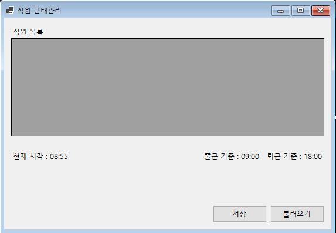

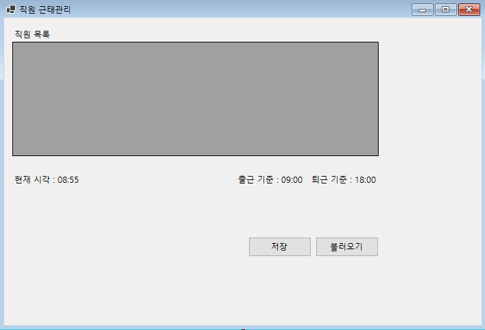

## Anchor에 대해 알아보자
`Anchor`속성은 부모 컨테이너의 사이즈가 변경되었을 때 컨트롤의 위치와 사이즈가 어떻게 반응할지를 결정합니다. Anchor로 설정할 수 있는 값은 총 4개이며 `Left, Top, Right, Bottom`인데요, Form에 아무 컨트롤이나 배치한 후 `Anchor`속성을 보면 `Left, Top`임을 알 수 있습니다.

Anchor 속성을 변경하려 할 때 다음의 화면을 볼 수 있는데요,

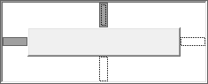

이 의미는 Left와 Top의 위치를 고정하겠다는 것입니다. 즉, `Form`의 사이즈를 늘리거나 줄여도 그 자리 그대로 있는 컨트롤을 배치할 수 있습니다.

그렇다면 Right와 Bottom으로 `Anchor`속성을 주었을때는 어떻게 될까요? 네. 컨트롤은 사이즈는 고정이되 늘어난 `Form` 만큼 따라 움직이는 것을 알 수 있습니다.

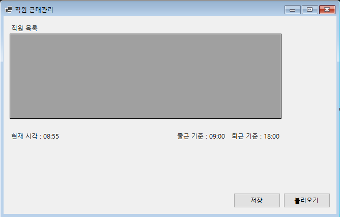

- `Anchor`에 아무런 설정이 없을 경우 사이즈는 변하지 않지만 위치가 따라 변합니다.
- `Anchor`에 `Left, Top, Right, Bottom`을 모두 주었을 경우 위치는 변하지 않고 컨트롤 사이즈가 따라 변합니다.

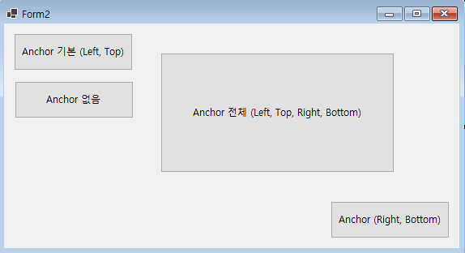

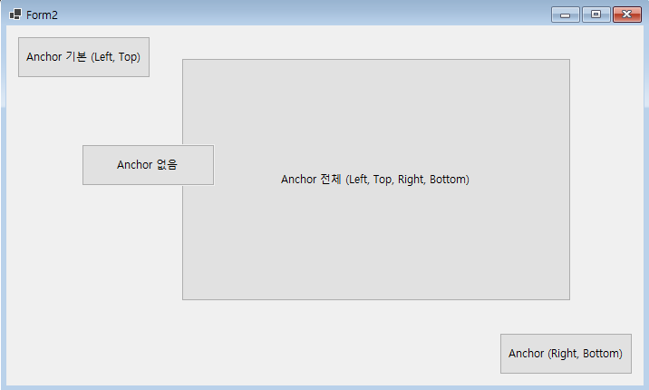

## Dock에 대해 알아보자
`Dock`속성은 컨트롤을 부모 컨테이너의 `Left, Top, Right, Bottom, 또는 Fill`의 값으로 왼쪽, 상단, 오른족, 하단 또는 전체에 배치할 수 있게 합니다. 즉, `Dock`을 사용하면 위치를 사용하지 않고 사이즈만 사용하게 되는데요, `Fill` 설정의 경우 사이즈도 사용하지 않게 됩니다.

- `Dock`이 `Left`일 경우
  
  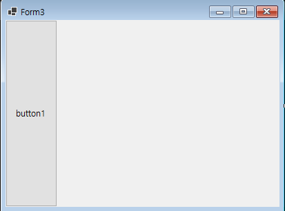

- `Dock`이 `Top`일 경우

  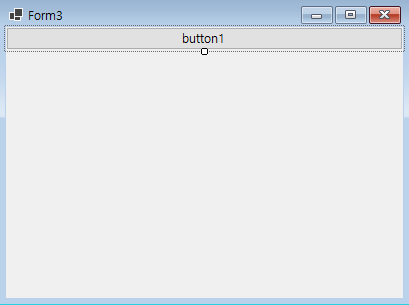

- `Dock`이 `Right`일 경우
  
  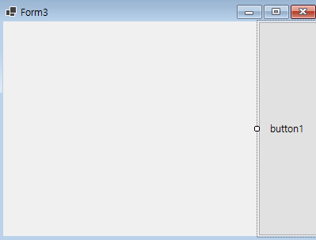

- `Dock`이 `Bottom`일 경우

  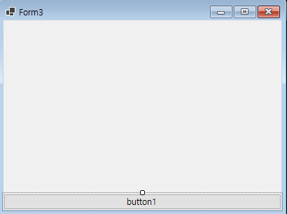

- `Dock`이 `Fill`일 경우
  
  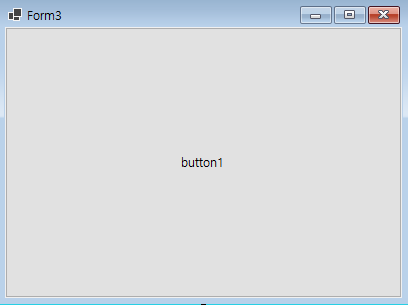

`Dock`은 특히 컨트롤의 순서에 따라 중첩될 수 있습니다. 사실 이 특징을 이용해 다양한 응용을 할 수 있게 됩니다.

- 상단, 하단 고정, 중앙 반응사이즈로 하고 싶을 경우,
  
  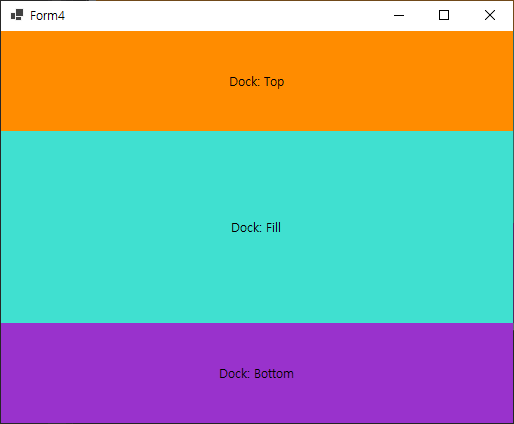

- 입력 폼을 이쁘게 배치하고 싶을 경우

  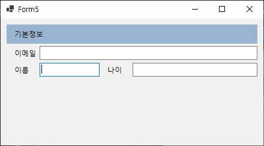

  
## 어떨 때 Anchor를 쓰고 Dock을 쓰면 될까?
- `Form` 사이즈를 자유롭게 움직여도 여전히 보기좋은 컨트롤 배치를 원할 때 `Anchor`를 씁니다.
- `Form`에 다양한 고정 분할 구성을 하고 싶을 때 `Dock`을 씁니다.
  - 분할 구성을 위해 `SplitContainer`를 대신 쓸 수 도 있습니다.
- 보기좋게 컨트롤들을 행으로 표현하고 싶을 때 `Dock`을 씁니다.

## 정리
이제 `Anchor`, `Dock` 기능을 이용해서 컨트롤 배치를 효율적이고 보기좋게 할 수 있음을 알게 되었습니다. 특히 `Dock`의 경우 분할 레이아웃을 구성하거나 컨트롤들을 행으로 일관되게 보여지게 할 수 있음을 알게 되었습니다. 

## 샘플
- 위의 화면은 샘플에서 직접 확인할 수 있습니다.
  - [예제 샘플](sample/sample.zip)

## 문서 기여자
- 작성한 사람: 디모이(dimohy)
