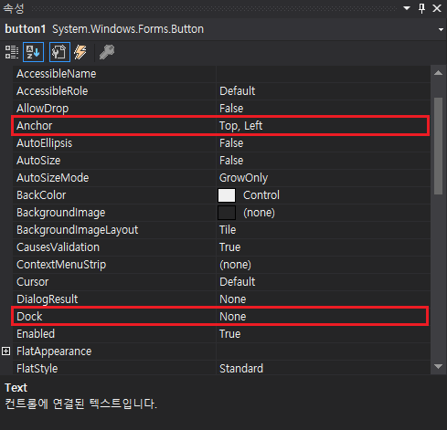

# Anchor, Dock을 이용한 컨트롤 레이아웃 디자인
Windows Forms에서는 Anchor 및 Dock 속성을 통해 컨트롤 배치에 대한 제어를 할 수 있습니다. 의외로 Anchor와 Dock의 기능에 대해서 모르시는 분들이 많은데요, 이 기능을 이용하면 어떤 편리함이 생기는지 알아봅시다.

## 필요성

..

## 테스트 환경
- Visual Studio 2019
- .NET 5, C# 9
- Windows Forms

## Anchor란?
..

## Dock란?
..

## 사용
..

## 정리
..

## 샘플
..

## 문서 기여자
..
