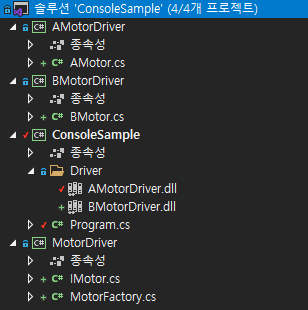
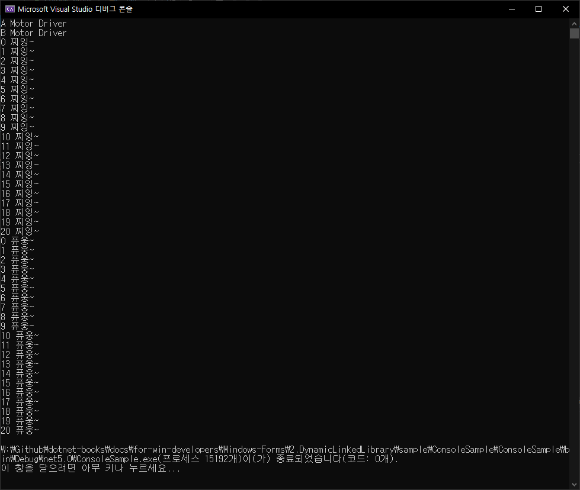
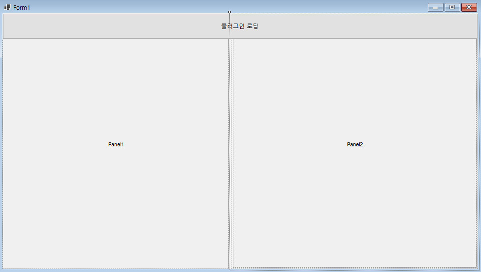
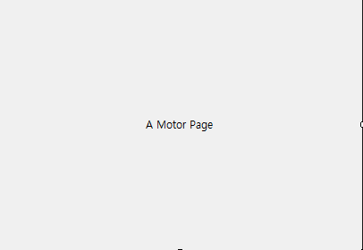
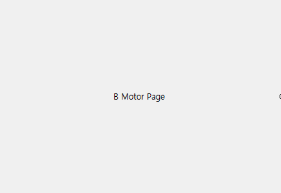
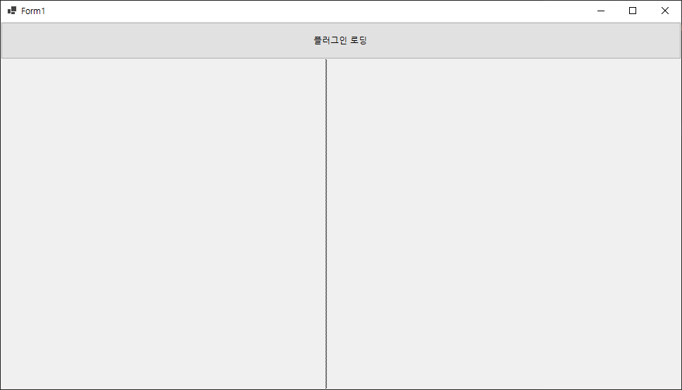
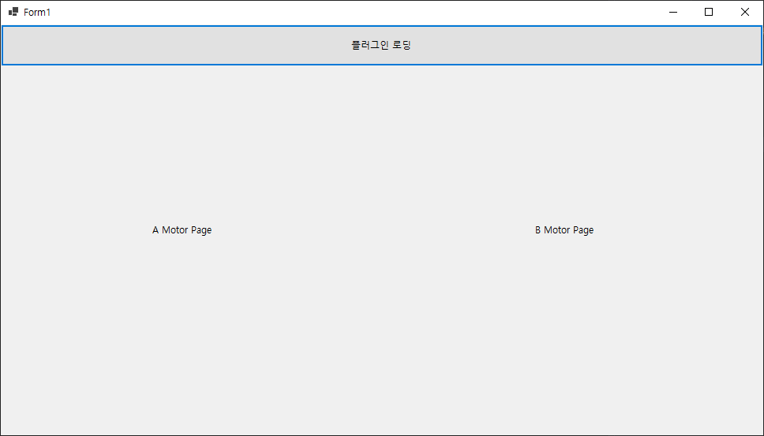

# 디자인패턴을 이용한 DLL 동적 로딩
이번 장에서는 `디자인패턴을 이용해 DLL을 동적 로딩`하는 방법을 알아보고자 합니다.

## 테스트 환경
- Visual Studio 2019
- .NET 5, C# 9
- Console, Windows Forms

## 왜 필요하지?
플러그인 또는 확장기능을 들어보셨다면, 바로 그 기능을 구현할 수 있다고 이해하시면 되겠습니다. 몇가지 예를 들어볼께요.
- 이미지 편집 프로그램을 만들었는데, 다양한 필터링 효과를 플러그인으로 제공하고 싶다.
- 모터를 이용하는 프로그램을 만들었는데, 다른 회사의 제품을 사용할 일이 생겼다. 그리고 계속 그럴일이 많을 것 같고 프로그램은 수정하고 싶지 않다.
- 응용 어플리케이션의 각 메뉴를 DLL 로 구성하고 싶다. 그리고 업데이트는 DLL 만 해도 되게 만들고 싶다.

간단히 예를 들어보았는데요, 이런 기능을 구현하기 위해서 DLL을 동적으로 로딩해서 연결하는 구현을 해야 합니다.

## DLL 동적로딩
.NET 라이브러리에서 DLL(Dynamic Linked Library)를 `Assembly`로 동적 로딩하는 기능을 제공합니다. 

```csharp
var assembly = Assembly.LoadFrom(assemblyPath);
```

위의 메소드를 이용해도 되지만 `assembly`를 언로드 할 수 없어서 `AssemblyLoadContext`를 이용하는게 좋습니다. `AssemblyLoadContext`를 이용해 언로드 기능을 사용하기 위해서는 다음의 글을 참고하면 도움이 됩니다.

> [.NET Core에서 어셈블리 언로드 기능을 사용하고 디버그하는 방법](https://docs.microsoft.com/ko-kr/dotnet/standard/assembly/unloadability)

`AssemblyLoadContext`를 상속받아 적절히 구현한 후,

```csharp
var assembly = myAssemblyLoadContext.LoadFromAssemblyPath(assemblypath);
```

그런다음 `assembly`를 통해 `Activator.CreateInstance(type)`등으로 클래스의 인스턴스를 생성할 수 있게 됩니다.

그리고 동적 로딩한 어셈블리들을 `AssemblyLoadContext`단위로 `Unload`를 통해 로딩을 해제 할 수 있습니다.

```csharp
myAssemblyLoadingContext.Unload();
```

`Assembly`까지 얻어오면 이후 `Type`을 알면 동적으로 생성할 수 있는데요, 이때 디자인패턴 중 생성패턴을 이용해야 좀 더 범용적인 구조를 설계할 수 있습니다.

## 디자인 패턴이란?
[디자인 패턴](https://ko.wikipedia.org/wiki/%EC%86%8C%ED%94%84%ED%8A%B8%EC%9B%A8%EC%96%B4_%EB%94%94%EC%9E%90%EC%9D%B8_%ED%8C%A8%ED%84%B4)은 소프트웨어 디자인에서 공통으로 발생하는 문제를 구조적으로 해결하기 위한 프로그래밍 패턴 입니다. 특히 [GoF의 디자인패턴](https://ko.wikipedia.org/wiki/%EB%94%94%EC%9E%90%EC%9D%B8_%ED%8C%A8%ED%84%B4_(%EC%B1%85))에 의해 프로그래머에게 알려지게 되었습니다.

디자인 패턴은 `생성패턴`, `구조패턴`, `행동패턴`으로 나눠 다양한 패턴들을 설명하고 있으며, 필요한 패턴을 코딩에 적용할 수 있습니다.

처음 `디자인패턴`을 접하면, 어떻게 적용할지 막막할 수 있는데요, 제 경험으로는 `인터페이스`를 통해 코드와 코드간의 응집력을 최소화 하는 노력의 일환이라고 이해하면 좋을 것 같습니다. 그 관점으로 필요한 만큼 구조를 차용해서 쓰면 모듈화가 좀 더 되지 않을까 생각해 봅니다.

## 빨리 확인해봅시다
플러그인 구조를 빨리 확인하기 위해 콘솔 어플리케이션으로 진행을 해볼텐데요, [콘솔 예제](sample/ConsoleSample.zip)를 통해 다음과 같은 구조를 확인하실 수 있는데요, 



```
   ConsoleSample - 테스트 프로그램
   MotorDriver - MotorDriverFactory, IMotorDriverFactory, IMotor
        |
        +- AMotorDriver - AMotorDriverFactory, AMotor
        |
        +- BMotorDriver - BMotorDriverFactory, BMotor
```

```csharp
    /// <summary>
    /// MotorDriver 인스턴스를 생성하는 팩토리 인터페이스
    /// </summary>
    public interface IMotorDriverFactory
    {
        string DriverName { get; }

        IMotor Create(int id);
    }

    /// <summary>
    /// MotorDriver 인터페이스
    /// </summary>
    public interface IMotor
    {
        int Id { get; }

        double Position { get; }
        Task MoveAsync(double position);
        Task ResetAsync();
    }
```

`AMotorDriver`와 `BMotorDriver`에서 각각 `IMotor`, `IMotorDriverFactory`를 구현합니다.

```csharp
    public class AMotor : IMotor
    {
        public int Id { get; private set; }

        public AMotor(int id)
        {
            this.Id = id;
        }

        public double Position { get; private set; }

        public async Task MoveAsync(double position)
        {
            var sp = this.Position;
            var ep = position;

            for (var i = sp; i <= ep; i++)
            {
                this.Position = i;
                Console.WriteLine($"{i} 찌잉~");
                await Task.Delay(100);
            }
        }

        public async Task ResetAsync()
        {
            await Task.Yield();
            Position = 0;
        }
    }

    public class AMotorDriverFactory : IMotorDriverFactory
    {
        public string DriverName => "A Motor Driver";

        public IMotor Create(int id) => new AMotor(id);
    }
```

BMotorDriver는 AMotorDriver에 비해 움직이는 속도가 다르다는 것을 다음처럼 표현했습니다. `MoveAsync(position)`에서
```csharp
    ...
    Console.WriteLine($"{i} 퓨웅~");
    await Task.Delay(10);
    ...
```

그리고 드라이브명이 달라야 하므로, BMotorDriverFactory에서 `DriverName`이
```csharp
    public string DriverName => "B Motor Driver";
```

이부분만 다르고 나머지는 동일합니다. 

실제 모터의 구동은 모터 운동 가감속도, 영점, 상태, 기어비 등 좀 더 복잡하고 다양한 예외처리가 필요하겠지만, 구조를 표현하기 위해 기능은 구분될 정도로만 간단하게 표현했습니다.

이제 `IMotorFactory`를 구현한 DLL을 읽는 `MotorFactor`를 구현해야 하는데요, 소스코드는 다음과 같습니다.

```csharp
    public class MotorFactory
    {
        private Dictionary<string, IMotorDriverFactory> motorFactoryMap;

        public MotorFactory(string driverPath)
        {
            Load(driverPath);
        }

        public IMotor Create(string driverName, int id)
        {
            var bResult = motorFactoryMap.TryGetValue(driverName, out var motorFactory);
            if (bResult == true)
                return motorFactory.Create(id);

            return null;
        }

        private void Load(string driverPath)
        {
            motorFactoryMap = new();

            var motorDriverDlls = Directory.GetFiles(driverPath, "*.dll");
            foreach (var motorDriverDll in motorDriverDlls)
            {
                var assembly = AssemblyLoadContext.Default.LoadFromAssemblyPath(motorDriverDll);
                var factoryType = assembly.GetTypes().Where(x => typeof(IMotorDriverFactory).IsAssignableFrom(x) == true).FirstOrDefault();
                if (factoryType == default)
                    continue;

                var factory = Activator.CreateInstance(factoryType) as IMotorDriverFactory;
                motorFactoryMap[factory.DriverName] = factory;
            }
        }

        public IEnumerable<string> GetDriverNames() => motorFactoryMap.Keys;
    }
```

MotorDriverFactory는 DLL에서 `IMotorFactory`를 구현한 클래스를 찾아 인스턴스를 만들고, `Create` 메소드를 호출할 때 해당 인스턴스를 통해 해당 DLL의 모터 인스턴스를 생성해서 반환할 수 있게 됩니다.

### 테스트 코드
```csharp
using System;
using System.IO;
using System.Reflection;
using MotorDriver;


var driverPath = Path.Combine(Path.GetDirectoryName(Assembly.GetExecutingAssembly().Location), "Driver");
var motorDriverFactory = new MotorFactory(driverPath);

// 총 두개의 모터 드라이버 검색 됨
foreach (var driverName in motorDriverFactory.GetDriverNames())
    Console.WriteLine(driverName);

// 각각의 모터 드라이버에서 모터 생성
var motor1 = motorDriverFactory.Create("A Motor Driver", 1);
var motor2 = motorDriverFactory.Create("B Motor Driver", 2);

// 모터 이동
await motor1.MoveAsync(20);
await motor2.MoveAsync(20);
```
### 실행화면


## Windows Forms에도 DLL에서 동적으로 화면을 가져올 수 있을까요?
당연히 가능합니다. UI 어플리케이션에서 플러그인을 추가하면 설정메뉴에서 해당 플러그인의 설정이 추가된다던가, 플러그인에서 제공하면 화면이 추가된다던가 하는것을 보셨을 텐데요, 원리는 위의 콘솔 예제와 동일합니다.

`UserControl` 형태로 플러그인에서 화면을 만들고, 콘솔 예제와 동일한 팩토리패턴을 이용해 본 어플리케이션에서 인스턴스를 생성할 수 있게 해주면 되는데요, 위의 예제를 수정해서 간단히 구현해보도록 합시다.

코드가 중복되므로 중요 내용만 보도록 합시다.

### 화면구성


`플러그인 로딩` 버튼을 클릭하면 왼쪽과 오른쪽 패널에 각각 로딩된 페이지가 표시되도록 구성합니다.

`AMotorPage`는 간단히 라벨로 표현했습니다.



`BMotorPage`도 간단히 라벨로 표현했습니다.



`MotorPageFactor`및 `IMotorPage` 인터페이스
```csharp
    /// <summary>
    /// IMotorPage 인스턴스를 생성하는 팩토리 인터페이스
    /// </summary>
    public interface IMotorPageFactory
    {
        string DriverName { get; }

        IMotorPage Create(int id);
    }

    /// <summary>
    /// MotorDriver 인터페이스
    /// </summary>
    public interface IMotorPage
    {
        int Id { get; }

        UserControl Page { get; }
    }
```

`AMotor.cs`에서 `UserControl` 페이지를 반환하는 것으로 수정
```csharp
    public class AMotor : IMotorPage
    {
        public int Id { get; }

        public UserControl Page { get; }

        public AMotor(int id)
        {
            this.Id = id;
            this.Page = new AMotorPage();
        }
    }

    public class AMotorDriverFactory : IMotorPageFactory
    {
        public string DriverName => "A Motor Driver";

        public IMotorPage Create(int id) => new AMotor(id);
    }
```

`WinFormsSample`에서 버튼을 눌렀을 때 페이지를 로딩하여 화면에 보여주는 이벤트
```csharp
    private void button1_Click(object sender, EventArgs e)
    {
        var driverNames = factory.GetDriverNames();

        var motor1Page = factory.Create(driverNames.First(), 1);
        var motor2Page = factory.Create(driverNames.Last(), 2);

        motor1Page.Page.Dock = DockStyle.Fill;
        splitContainer1.Panel1.Controls.Add(motor1Page.Page);
        motor2Page.Page.Dock = DockStyle.Fill;
        splitContainer1.Panel2.Controls.Add(motor2Page.Page);
    }
```

### 실행화면
초기 페이지 로딩 전



`플러그인 로딩` 버튼 클릭 후




## 샘플
- 위의 예제에 대한 완전한 소스코드는 다음의 링크로 다운로드 받아 실행해 보실 수 있습니다.
  - [콘솔 예제](sample/ConsoleSample.zip)
  - [윈폼 예제](sample/WinFormsSample.zip)

## 문서 기여자
- 작성한 사람: 디모이(dimohy)
