# GDI+를 사용해 보자
이번 장에서는 Windows Forms에서 GDI+를 자유롭게 이용할 수 있도록 사용법을 살펴봐 보도록 하겠습니다.

## 테스트 환경
- Visual Studio 2019
- .NET 5, C# 9
- Windows Forms

## GDI+ 많이는 들어봤는데...
Windows 초창기 부터 그래픽 장치 인터페이스(GDI) API를 제공 했었는데요, Windows XP 운영체제부터 Windows GDI+를 사용할 수 있게 되었습니다. GDI+는 GDI에 비해 그라데이션 브러쉬 및 알파 블렌딩과 같은 새로운 기능이 추가되었고, 친숙한 개체지향 스타일로 각종 기능을 사용할 수 있게 되었습니다.

## Windows Forms에서 GDI+를 사용하려면?
두가지 방식이 있습니다. Windows Forms의 화면에 보여지는 모든 컨트롤들은 `OnPaintBackground()`및 `OnPaint()` 메소드를 재정의 할 수 있습니다. 이때, `e` 인자의 Graphics 개체를 통해 GDI+ 기능을 이용할 수 있습니다.
두번째 방법은 `CreateGraphics()` 메소드를 통해 `Graphics` 개체를 생성한 후 사용하는 방법입니다.
아, 한가지 방법이 더 있군요. `Bitmap` 개체를 `Graphics.FromImage()` 메소드를 통해 `Graphics`를 획득해서 사용할 수 있습니다.

## `Graphics`는 화면 출력 용으로만 사용하나요?
아닙니다. GDI+는 장치 컨텍스트에 독립적입니다. 그렇기 때문에 프린트 출력을 할때에도 `Graphics`를 사용하게 됩니다.

## 한번 해봅시다
먼저 `.NET 5`로 `Windows Forms` 응용 어플리케이션 템플릿으로 프로젝트를 생성한 후, 아무 컨트롤이나 폼에 배치해봅니다.

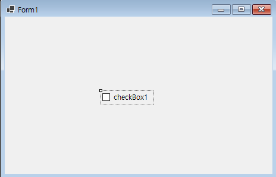

예시로 `CheckBox`를 생성해봤는데요, Windows Forms에서는 화면에 보이는 모든 컨트롤은 `Control`에서 상속받도록 되어 있습니다. 한번 추적해보죠.

```csharp
public class CheckBox : ButtonBase {}
public abstract class ButtonBase : Control {}
```

`OnPaintBackground()`및 `OnPaint()` 메소드는 `Control`의 메소드 이므로, Windows Forms의 보여지는 모든 컨트롤은 그리기 기능이 존재하는 샘입니다.

그렇다면 `Control`에서 상속받아 구현을 해볼까요? 이름을 `CanvasControl`이라고 하겠습니다.

```csharp
    public class CanvasControl : Control
    {
        protected override void OnPaintBackground(PaintEventArgs pevent)
        {
            var g = pevent.Graphics;

            g.Clear(Color.Black);
        }

        protected override void OnPaint(PaintEventArgs e)
        {
            base.OnPaint(e);
        }
    }
```

폼 디자이너에서 컨트롤이 구분되도록 배경색을 검정색으로 칠하는 코드만 넣었습니다. 그런 다음 폼 디자이너에서 `CanvasControl`을 추가하면 다음처럼 보이게 됩니다.

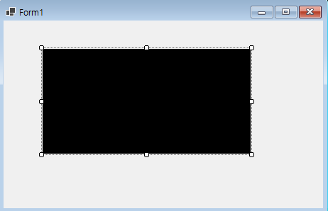

실행화면1

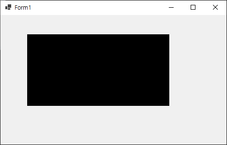

컨트롤이 화면에 보여져야 할 때 먼저 `OnPaintBackground()`가 호출되어 배경을 그릴 수 있도록 하고, 그다음 `OnPaint()`가 호출되어 내용을 그릴 수 있게 되어 있습니다. 이런식으로 Windows Forms 컨트롤이 화면에 보여지게 되는거죠.

그런데 검정 배경화면만 있으니 `BackColor`에 검정 지정한 것 마냥 차이가 없습니다. 검정색 배경에 도형을 그려보도록 합시다.

```csharp
    protected override void OnPaint(PaintEventArgs e)
    {
        var g = e.Graphics;
        var rect = ClientRectangle;
        var clipRect = e.ClipRectangle;

        // 선
        g.DrawLine(Pens.Red, 50, 50, 100, 100);

        // 면
        g.DrawRectangle(Pens.Green, 10, 10, 30, 30);

        // 원
        g.DrawEllipse(Pens.Blue, 100, 100, 50, 50);
    }
```

실행화면2

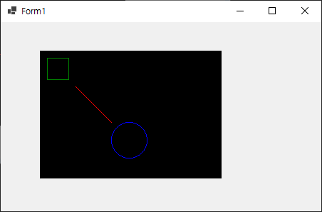

원하는대로 잘 그려지는군요. 그런데 한가지 궁금한 점이 생깁니다. 

## `OnPaint()`는 정확히 언제 호출될까요?
Windows Forms는 나름 효과적으로 컨트롤을 그리도록 최적화 되어 있는데요, 화면에 새로 보여질 때만 호출된다는 점입니다. 다음의 코드로 이를 확인해봅시다.

```csharp
    private bool firstDraw = true;
    protected override void OnPaint(PaintEventArgs e)
    {
        var g = e.Graphics;
        var rect = ClientRectangle;

        // 선
        g.DrawLine(Pens.Red, 50, 50, 100, 100);

        // 면
        g.DrawRectangle(Pens.Green, 10, 10, 30, 30);

        // 원
        g.DrawEllipse(Pens.Blue, 100, 100, 50, 50);

        if (firstDraw == false)
            g.FillRectangle(Brushes.LightGray, rect);

        firstDraw = false;
    }
```

`firstDraw`에 의해 두번째 그리기부터는 전체 영역을 회색으로 그리도록 했는데요,

최초화면

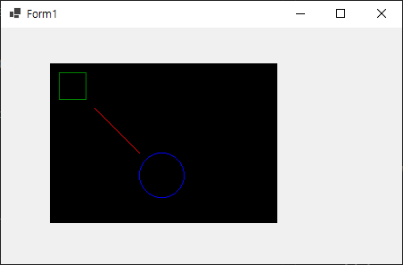

폼의 사이즈를 작게 조절해서 다음과 같이 줄인 후,

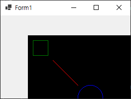

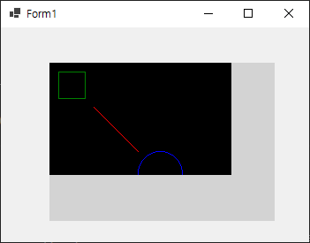

신기합니다. 분명히 컨트롤 전체 영역에 갈색으로 칠해져야 할 텐데요, 다시 그려져야 할 영역만 칠하고 있습니다. `OnPaint()` 메소드가 호출될 때의 `Graphics`는 갱신되어야 할 영역만 그려지도록 클리핑(Clipping) 됨을 알 수 있습니다.

```csharp
        protected override void OnPaint(PaintEventArgs e)
        {
            var g = e.Graphics;
            var rect = ClientRectangle;

            g.FillEllipse(Brushes.Green, rect);
        }
```

위와 같이 수정한 후 `CanvasControl`을 폼에 `Dock.Fill` 해 봅시다.

실행화면

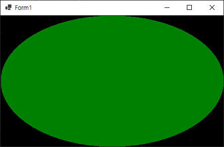

`ClientRectangle`은 컨트롤의 그릴 수 있는 영역입니다. 예상했던 대로 녹색으로 가득 찬 원이 그려졌는데요, 사이즈를 한번 늘려봅시다.

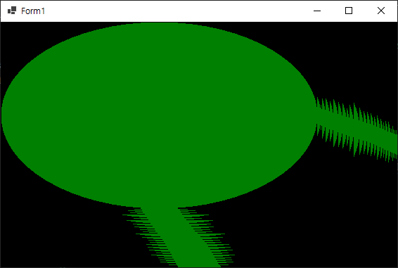

원이 크기에 맞게 늘어나거나 줄어드는 예상과 달리 Windows Forms의 효율적 그리기로 인해서 이상하게 보입니다.

컨트롤의 사이즈가 변경되었을 때 전체를 다시 그려야 할 경우,

```csharp
        public CanvasControl()
        {
            ResizeRedraw = true;
        }
```
이렇게 `ResizedRedraw` 속성에 `true`를 적용하면,

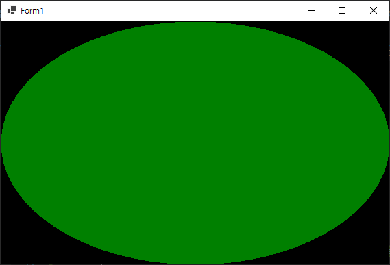

컨트롤의 사이즈가 변경됐을 때 전체 영역을 다시 그리게 됩니다.

## GDI+ 개체에 대해 알아봅시다
Windows Forms에서 제공하는 GDI+ 기능은 대부분 Windows GDI+의 레퍼 기능이며, 컨트롤에서 생성하거나, 이미지에서 생성하거나, `OnPaint()` 인자로 받는 `Graphics`를 통해 GDI+ 기능을 사용할 수 있게 됩니다.
GDI+ 에서 제공하는 개체는 다음과 같습니다.

- Graphics
    - GDI+ 그리기 화면을 캡슐화 합니다. 이 개체를 통해 GDI+ 기능을 이용하게 됩니다.
- Image
    - Bitmap 및 Metafile 서브클레스에 기능을 제공하는 추상 기본 클래스입니다.
- Bitmap
    - 그래픽 이미지의 픽셀 데이터와 그 특성으로 구성되는 GDI+ 비트맵을 캡슐화 합니다. Bitmap은 픽셀 데이터로 정의된 이미지에서 작업하는 데 사용하는 개체가 됩니다.
- Metafile
    - 그래픽 메타피일입니다. 메타파일은 일종의 벡터 이미지 이며, 생성과 표시할 수 있는 그래픽 작업 시퀀스를 설명하는 레코드로 구성됩니다.
- Font
    - 글꼴, 크기 및 스타일 특성을 포함하여 텍스트의 특정 형식을 정의합니다.
- Brush
    - 사각형, 타원, 파이, 다각형 및 경로와 같은 그래픽 도형의 내부 면을 채우는데 사용하는 개체입니다.
- Color
    - 알파, 빨강, 녹색, 파랑(ARGB)를 나타냅니다.
- Matrix
    - 기하학정 변환을 나타내는 상관 매트릭스를 캡슐화 합니다.
- TextRenderer
    - GDI의 텍스트 기능을 제공합니다.

`IDisposable` 인터페이스가 구현된 개체는 반드시 사용이 완료되면 `Dispose`해야 하며 그 이유는 내부적으로 비관리 헨들을 사용해 운영체제의 자원이 사용되기 때문입니다.

## GDI+의 좌표체계 및 변환
GDI+는 그릴 항목을 회전, 크기 조정, 변환등을 할 수 있도록 좌표 변환 체계를 가지고 있습니다.
- World 좌표 : world는 그리기 원래(상대) 좌표입니다.
- Page 좌표 : page는 전체 페이지를 기준으로 하는 절대 좌표입니다.
- Device 좌표 : page와 device의 단위가 다를 경우 좌표가 변환됩니다.

예제의 `Draw()`메소드에서 world 좌표 공간을 사용합니다. `TranslateTransform()`등의 Matrix 기능을 이용하면 이것을 Page 좌표로 변환할 수 있습니다. 즉, 좌표 (0,0)을 기준 (또는 사용자의 임의)에 의해 구성된 항목을 회전, 크기 조정, 위치 조정을 할 수 있게 됩니다.

```csharp
        protected override void OnPaint(PaintEventArgs e)
        {
            Sample3(e);
        }

        private void Sample3(PaintEventArgs e)
        {
            var g = e.Graphics;
            var rect = ClientRectangle;

            g.TranslateTransform(100, 50);
            Draw(g, Font);

            g.TranslateTransform(130, 130);
            Draw(g, Font);

            g.TranslateTransform(130, 130);
            g.ScaleTransform(1.5f, 1.5f);
            g.RotateTransform(45);
            Draw(g, Font);

            ////

            static void Draw(Graphics g, Font font)
            {
                using var glPen = new Pen(Color.White)
                {
                };
                using var sPen = new Pen(Color.White);

                g.DrawLine(glPen, 0, 0, 150, 0);
                g.DrawLine(sPen, 50, -5, 50, 5);
                g.DrawLine(sPen, 100, -5, 100, 5);
                g.DrawString("50", font, Brushes.White, 41, -24);
                g.DrawString("100", font, Brushes.White, 88, -24);
                g.DrawString("x", font, Brushes.White, 160, -8);

                g.DrawLine(glPen, 0, 0, 0, 100);
                g.DrawLine(sPen, -5, 50, 5, 50);
                g.DrawString("50", font, Brushes.White, -26, 42);
                g.DrawString("y", font, Brushes.White, -6, 110);

                g.DrawLine(Pens.Red, 0, 0, 160, 80);
            }
        }
```

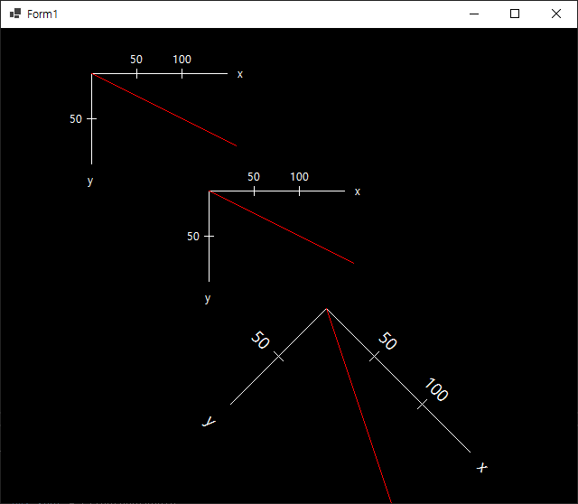

위의 예제에서 소개되지 않은 기능을 포함한 관련 GDI+ 기능은 다음과 같습니다. 간단히 예제를 만들어 결과를 확인하면 어떻게 동작하는지를 알 수 있습니다.

- Transform
    - Transform에 의해 World 좌표를 Page 좌표로 매핑합니다.
- TransformPoints
    - World 및 Page, Device 좌표간의 변화 계산을 합니다.
- TranslateClip
    - 가로, 세로로 지정된 클립 영역을 변환합니다.
- TranslateTransform
    - 좌표계의 원점을 변경합니다.
- MultiplyTransform
    - Graphics의 Transform(Matrix)와 지정된 Matrix를 곱합니다.
- ResetTransform
    - Transform을 초기화 합니다.
- RotateTransform
    - 회전을 적용합니다.
- ScaleTransform
    - 크기 조정을 적용합니다.

## 그리기의 깜빡임을 없애봅시다
화면 Graphics를 이용하면 즉각적으로 화면에 항목이 그려집니다. 그런데 항목을 이동해야 하는 등 전체 영역을 다시 그려야 할 경우 지우는 작업에 의해 화면이 깜빡이게 되는데요, 여기서는 `Bitmap`을 통해서 깜빡임을 없애는 방법에 대해서 설명하겠습니다.

```csharp
    private Bitmap buffer;
    private Graphics bg;
    protected override void OnResize(EventArgs e)
    {
        base.OnResize(e);

        if (buffer != null)
            buffer.Dispose();

        buffer = new Bitmap(ClientSize.Width, ClientSize.Height);
        bg = Graphics.FromImage(buffer);
    }

    protected override void OnPaintBackground(PaintEventArgs pevent)
    {
    }

    protected override void OnPaint(PaintEventArgs e)
    {
        Sample4(e);

        Invalidate();
    }

    private int x, y;
    private void Sample4(PaintEventArgs e)
    {
        var g = e.Graphics;

        x++;
        if (x > ClientSize.Width)
        {
            x = 0;
            y += 20;
        }
        bg.TranslateTransform(x, y);
        
        bg.ScaleTransform(0.3f, 0.3f);
        Draw(bg);
        bg.ResetTransform();

        g.DrawImage(buffer, 0, 0);

        // ----
        void Draw(Graphics g)
        {
            g.Clear(Color.Black);

            g.FillEllipse(Brushes.Green, ClientRectangle);
        }
    }
```

컨트롤의 ClientSize만큼의 Bitmap을 생성한 후, 영역을 `OnPaintBackground()`에서 지우는 대신 Bitmap에서 획득한 Graphics를 지워줍니다. 그리기 작업 후, `OnPaint()`에서는 Bitmap을 `DrawImage`하는 것으로 메모리에서 작업한 항목을 그려서 깜빡임을 없앨 수 있게 되었습니다.

## 샘플
위의 예제에 대한 샘플 소스코드는 다음의 링크로 다운로드 받아 실행해 볼 수 있습니다.

- [샘플 소스코드](sample/GDIPlusSample.zip)

## 참고
- [.NET Windows Forms / GitHub](https://github.com/dotnet/winforms)
- [Windows Forms의 그래픽 및 그리기](https://docs.microsoft.com/ko-kr/dotnet/desktop/winforms/advanced/graphics-and-drawing-in-windows-forms?view=netframeworkdesktop-4.8)

## 문서 기여자
- 작성한 사람: 디모이(dimohy)
