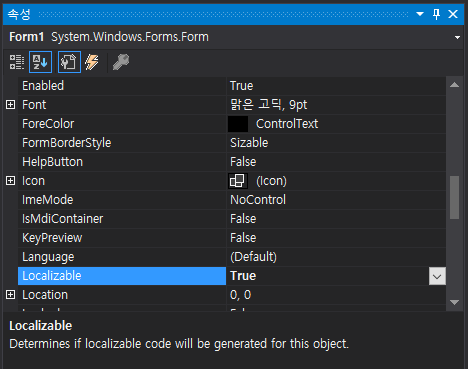

# 지역화 기능을 이용한 다국어 지원하기
Windows Forms에서 제공하는 폼 기반 리소스를 이용화면 화면에 보이는 텍스트 및 각종 리소스를 언어 별로 별도 처리 할 수 있게 됩니다.
폼 기반 리소스와 함께 프로젝트 리소스 방식을 이용할 수 있습니다.

- 폼 기반 리소스
  - 폼의 텍스트 및 이미지와 같은 지역화 가능한 UI 요소에 대한 리소스 파일을 생성합니다. 이후 리소스 파일이 어셈플리에 내장되게 됩니다. 이를 폼 기반 리소스라고 합니다.
- 프로젝트 리소스
  - 리소스 파일 템플릿을 추가한 다음 XML 디자이너를 통해 리소스를 편집합니다. 그런 후 코드를 통해 리소스에 접근하는 방식을 프로젝트 리소스라고 합니다.

일반적으로 Windows Forms 응용 프로그램에서 UI 요소와 관련된 대부분의 리소스에 폼 기반 리소스를 사용해야 편리합니다. 그러나 오류 메시지와 같은 비형태 기반의 사용자 인터페이스 문자열 및 이미지의 경우 프로젝트 리소스를 이용해야 합니다.

## 테스트 환경
- Visual Studio 2019
- .NET 5, C# 9
- Windows Forms

## 폼 기반 리소스를 이용한 지역화

Windows Forms은 `Localizable` 속성을 통해 지역화 대상 리소스를 자동 생성하는 기능이 있습니다. 이 속성을 `True`로 변경합시다.

