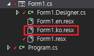
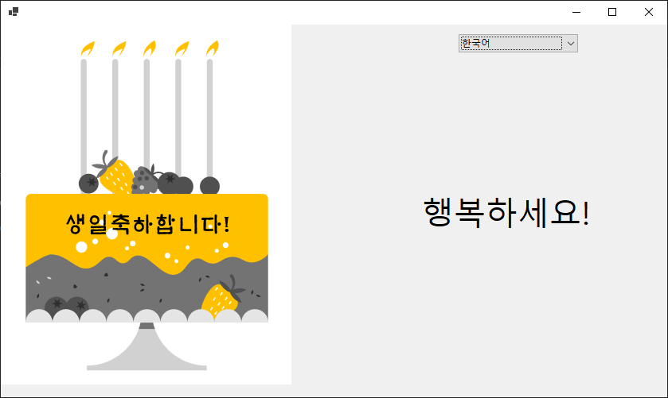
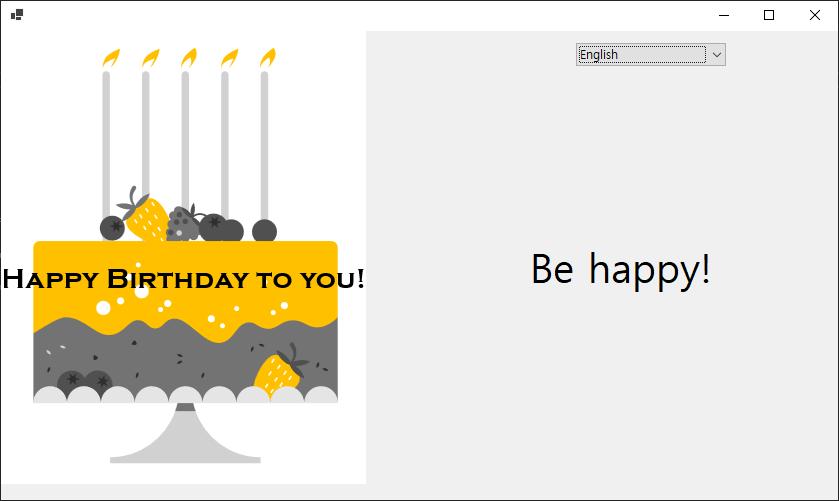
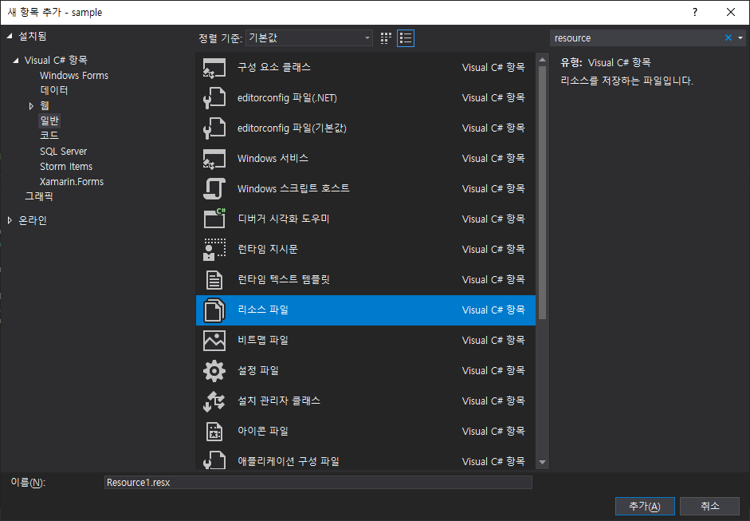
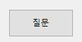
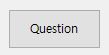
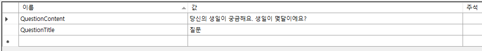
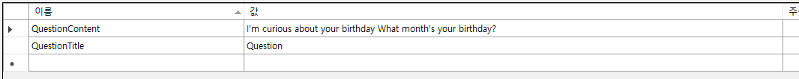
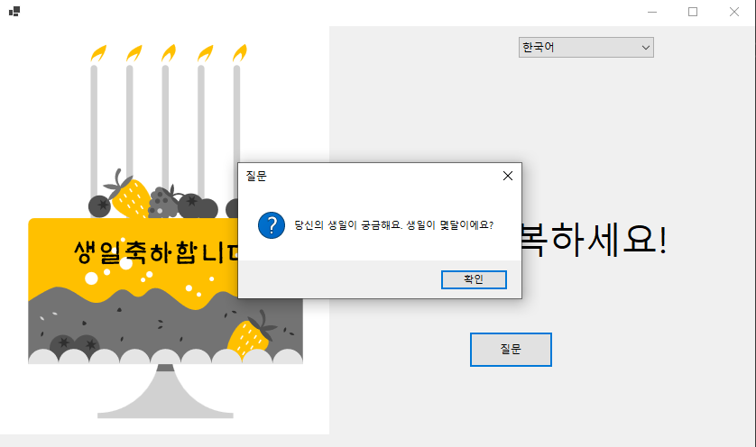
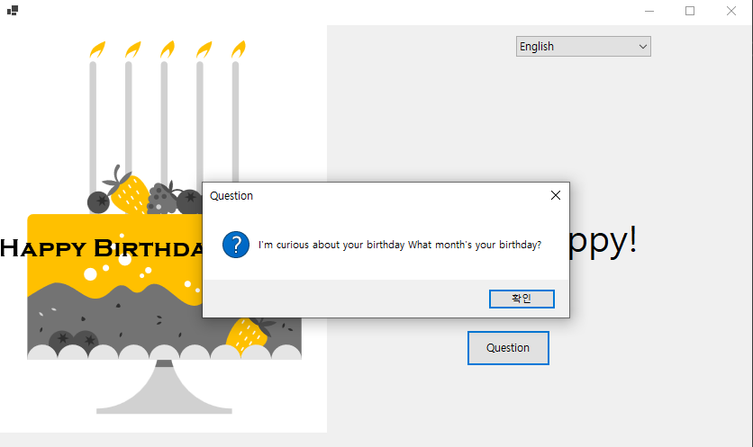

# 지역화 기능을 이용한 다국어 지원하기
Windows Forms에서 제공하는 폼 기반 리소스를 이용화면 화면에 보이는 텍스트 및 각종 리소스를 언어 별로 별도 처리 할 수 있게 됩니다.
폼 기반 리소스와 함께 프로젝트 리소스 방식을 이용할 수 있습니다.

- 폼 기반 리소스
  - 폼의 텍스트 및 이미지와 같은 지역화 가능한 UI 요소에 대한 리소스 파일을 생성합니다. 이후 리소스 파일이 어셈플리에 내장되게 됩니다. 이를 폼 기반 리소스라고 합니다.
- 프로젝트 리소스
  - 리소스 파일 템플릿을 추가한 다음 XML 디자이너를 통해 리소스를 편집합니다. 그런 후 코드를 통해 리소스에 접근하는 방식을 프로젝트 리소스라고 합니다.

일반적으로 Windows Forms 응용 프로그램에서 UI 요소와 관련된 대부분의 리소스에 폼 기반 리소스를 사용해야 편리합니다. 그러나 오류 메시지와 같은 비형태 기반의 사용자 인터페이스 문자열 및 이미지의 경우 프로젝트 리소스를 이용해야 합니다.

## 테스트 환경
- Visual Studio 2019
- .NET 5, C# 9
- Windows Forms

## 폼 기반 리소스를 이용한 지역화

Windows Forms은 `Localizable` 속성을 통해 지역화 대상 리소스를 자동 생성하는 기능이 있습니다. 이 속성을 `True`로 변경합시다.


`Language`속성에 `한국어`를 입력한 후 저장합니다. 



영어에 맞게 화면을 구성합니다.


그리고 한국어에 맞게 화면을 구성합니다.


이때, 주의해야 할 것은 문자열 뿐만 아니라 컨트롤의 속성도 리소스로 관리하게 되므로 컨트롤의 좌표 등 모든 리소스가 별도 저장이 됩니다. 그래서 되도록이면 `default` 폼을 완성 한 후 `Language`속성에 다른 언어를 입력하여 리소스를 생성하는게 좋습니다. 그렇지 않으면 리소스 별도 컨트롤을 일일히 조정해야 하는 불편함이 생깁니다.

지역화 된 리소스는 다음의 코드를 통해 적용됩니다.

```csharp
  var name = "ko-KR";
  var cultureInfo = new CultureInfo(name);
  Thread.CurrentThread.CurrentUICulture = cultureInfo;
  Thread.CurrentThread.CurrentCulture = cultureInfo;
```

그러면 폼은 `CurrentUICulture` 속성에 맞는 리소스를 찾아 적용하게 됩니다.

### 실행화면

한국어의 경우,



영어의 경우,



## 프로젝트에 리소스를 수동으로 추가
폼 종속적인 다양한 정적 리소스는 폼의 `Languages` 속성으로 생성되는 리소스 파일로 관리하는게 좋습니다. 그러나 폼에 직접적인 관련이 없는 정적 리소스나 상황에 따라 다르게 표현되어야 하는 동적 리소스의 경우 프로젝트에 수동으로 리소스를 추가하여 관리하게 됩니다.

프로젝트에 `추가/새 항목`을 통해 새로운 리소스 파일을 추가 합니다.



생성해야 하는 리소스 파일의 구성은 다음과 같습니다.

 - Resource1.resx : 기본 리소스 파일이 되며, 해당 지역의 언어 리소스가 없을 경우 선택됩니다.
 - Resource1.ko-KR.resx : 한국어(한국) 리소스 파일입니다.
 - Resource1.ko.resx : 한국어 리소스 파일입니다.

현 지역이 한국어(한국)인 경우, 최초 `Resource1.ko-KR.resx` 파일을 찾게 되고 없을 경우, 그 다음으로 `Resource1.ko.resx` 파일을, 이 파일도 없을 경우, `Resource1.resx` 이 파일을 리소스 파일로 선택하게 됩니다.

폼에 버튼을 배치하고 지역에 따라 버튼 `Text` 속성을 다르게 줍니다.

한국어,



영어,



그리고 `Resource1.resx`, `Resource1.ko-KR.resx` 및 `Resources1.en-US.resx`를 다음과 같이 입력합니다.

Resource1.ko-KR.resx



Resource1.resx 및 Resource1.en-US.resx



버튼 클릭 이벤트를 다음과 같이 코딩합니다.

```csharp
  private void button1_Click(object sender, EventArgs e)
  {
      MessageBox.Show(Resource1.QuestionContent, Resource1.QuestionTitle, MessageBoxButtons.OK, MessageBoxIcon.Question);
  }
```

### 실행화면

한국어 선택 시,



영어 선택 시,




## 샘플
위의 예제에 대한 샘플 소스코드는 다음의 링크로 다운로드 받아 실행해 볼 수 있습니다.

- [샘플 소스코드](sample/sample.zip)

## 문서 기여자
- 작성한 사람: 디모이(dimohy)