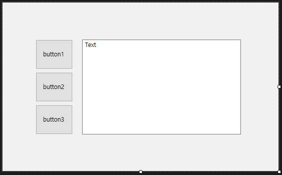
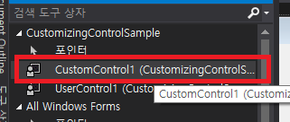
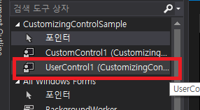
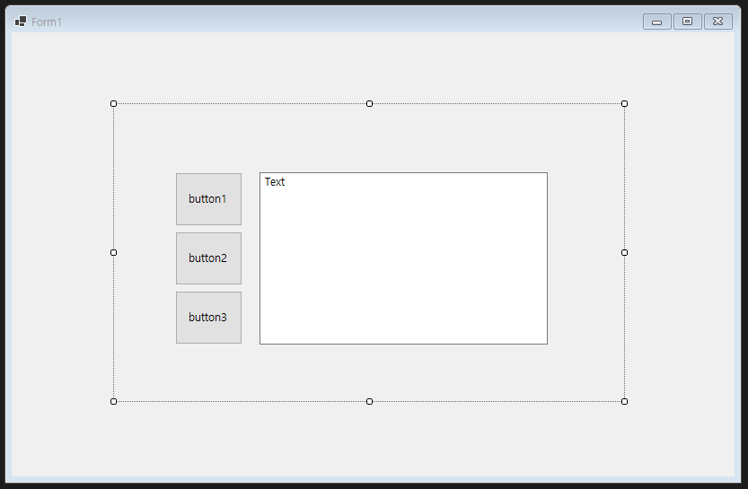
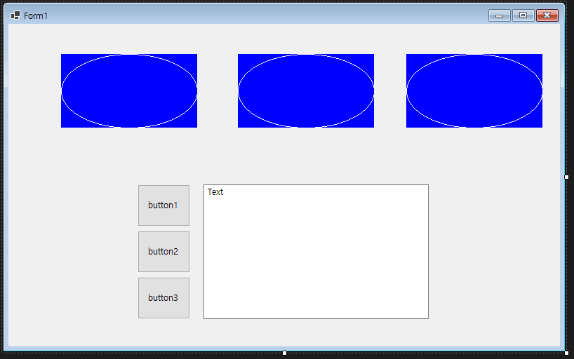
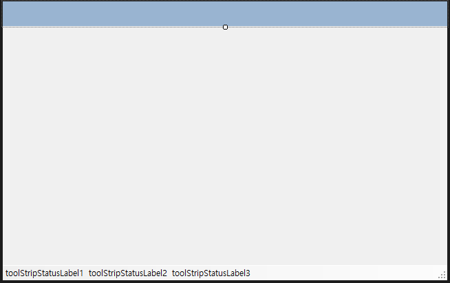
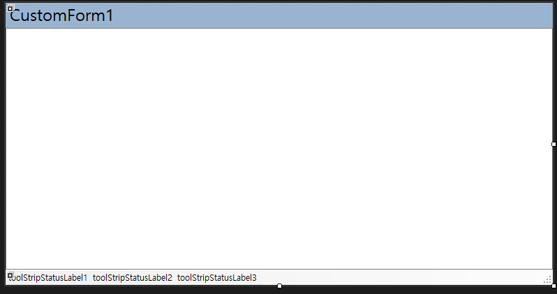

# 컨트롤 커스터마이징 (UserControl, CustomControl, Form)
Windows Forms에서는 여러 컨트롤들을 조합해서 하나의 컨트롤로 만드는 `UserControl`과 Control를 확장하여 다양한 그리기 효과를 추가할 수 있는 `CustomControl`, 그리고 Form을 폼 디자이너를 통해서 자신만의 폼 형태를 만드는 `From` 확장을 통해 자신만의 컨트롤 커스터마이징을 할 수 있습니다.

다음으로 각각을 특징에 대해서 짚어보겠습니다.

- UserControl: `ContainerControl`에서 구현되었으므로 여러 컨트돌들을 포함할 수 있습니다. 또한, `UserControlDocumentDesigner` 및 `ControlDesigner`를 통해 Form처럼 UI 디자이너를 이용해 내부 컨트롤들을 배치하고 구성할 수 있습니다.
- UserControl: UserControl은 `Control`을 부모 클래스로 구현하는 클래스입니다. 일반적으로 `OnPaint()` 메소드를 통해 자신만의 컨트롤 형태를 만들 때 사용할 수 있는데요, `Control` 뿐만 아니라 `Button`등 `Control`에서 파생된 다양한 Windows Forms 컨트롤에서 파생하여 구현한다면 `UserControl`이라고 할 수 있습니다.
- Form: Windows Forms로 개발하는 프로그래머라면 항상 폼 디자이너에서 폼을 디자인 하는 것으로 코딩을 시작할 것 같습니다. Form은 `FormDocumentDesigner`를 통해 UI 디자이너로 컨트롤들을 배치하고 구성할 수 있습니다. 또한, `Form`를 부모 클래스로 해서 자신만의 사용자 폼을 구성할 수 도 있습니다.

## 테스트 환경
- Visual Studio 2019
- .NET 5, C# 9
- Windows Forms

## UserControl



UI 디자이너를 이용해 폼 디자이너와 유사하게 컨트롤을 배치하면서 화면을 구성할 수 있습니다.

컴파일을 하게 되면 다음과 같이 해당 UserControl을 선택할 수 있도록 등록이 됩니다.



이것을 폼에 끌어다가 붙이면 다음처럼 배치가 되는데요,



이렇게 컨트롤들을 하나의 `UserControl`로 묶어서 관리하는 것은 파일선택 컨트롤이나 달력 등, 여러 컨트롤들을 하나로 묶어 한가지 목표를 달성하는 새로운 컨트롤로 만들 때 유용하고, 페이지 단위로 관리하고자 할 때 `UserControl`로 만드는것이 좋습니다.

## CustomControl

`Control`및 Control을 부모로 하는 클래스를 상속받아 구현한 컨트롤을 `CustomControl`이라고 합니다. 일반적으로는 그리기 동작을 자신만의 방식으로 바꾸고자 할 때 종종 쓰입니다.

다음처럼 Control을 상속하여 구현했을 때,

```csharp
    public partial class CustomControl1 : Control
    {
        public CustomControl1()
        {
            InitializeComponent();
        }

        protected override void OnPaint(PaintEventArgs pe)
        {
            base.OnPaint(pe);

            pe.Graphics.DrawEllipse(Pens.White, ClientRectangle);
        }
    }
```

컴파일 후 다음처럼 도구 상자에서 선택할 수 있도록 목록에 나타나게 되는데요,



이것을 드래깅하여 배치하면 다음처럼 여러개의 컨트롤로 배치할 수 있게 됩니다.



## Form

Form도 UserControl 처럼 자신만의 형태로 만든 후 재사용할 수 있습니다. 다음과 같이 폼을 만든 후,



폼을 새로 만들 때 다음처럼, 위의 폼에서 상속받아 만들면,

```csharp
    public partial class CustomForm1 : CustomForm
    {
        public CustomForm1()
        {
            InitializeComponent();
        }
    }
```



커스터마이징 된 폼을 사용할 수 있게 됩니다.

## 샘플
위의 예제에 대한 샘플 소스코드는 다음의 링크로 다운로드 받아 실행해 볼 수 있습니다.

- [샘플 소스코드](sample/CustomizingControlSample.zip)

## 문서 기여자
- 작성한 사람: 디모이(dimohy)